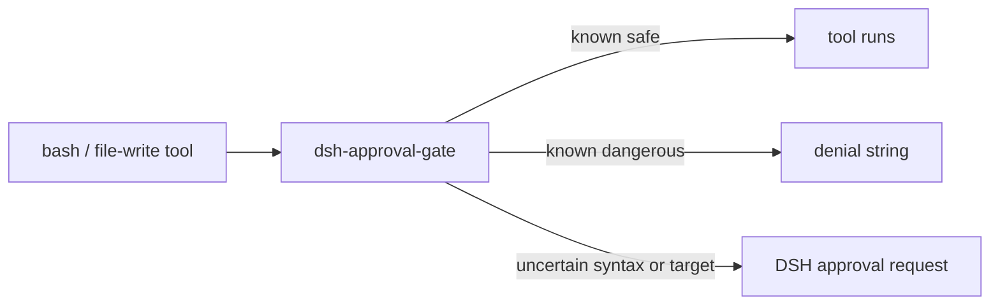

# 📦 @goodandready/dsh-approval-gate

<div align="center">

<h3>Last-line command gate for DeepSeek Harness</h3>

<p align="center">
  <a href="https://www.npmjs.com/package/@goodandready/dsh-approval-gate"></a>
  <a href="LICENSE"></a>
  <a href="https://github.com/topics/dsh-plugin"></a>
  <a href="https://nodejs.org"></a>
</p>

<p align="center">
  <a href="https://goodandready.app/"></a>
</p>

<p align="center">
  <a href="README.md"><b>English</b></a> ·
  <a href="README.zh.md"><b>中文说明</b></a> ·
  <a href="README.ru.md"><b>Русский</b></a>
</p>

<table align="center">
  <tr>
    <td align="center">
      ⭐ <strong>If you like this plugin, please star it on GitHub</strong> — it shows me that the plugin is useful to you and motivates me to keep developing it.
      <br><br>
      🐛 <strong>If you find a bug or would like to request a feature</strong>, open a GitHub issue in any language — I will review your proposal and implement useful suggestions in a future plugin version.
    </td>
  </tr>
</table>

</div>

---

## Overview

DeepSeek Harness can still let an agent run a dangerous tool call when sandbox mode is loose. This host-only plugin registers a monotonic `tools.guard` and denies the call before the tool body runs.

Commands the guard cannot fully inspect are routed through DSH’s native approval flow. This plugin does not implement a separate approval word.

## How it works



`lib/inspect.js` tokenizes the bash `command` (quotes, backslashes, pipelines, wrappers) and inspects the real argv. File-write tools are classified by path, not by regex over prose.

## Architecture and modules

| Module | Responsibility |
|---|---|
| lib/index.js | Registers the monotonic tools.guard and pre-execution approval hook; wires SecurityEngine into DSH. |
| lib/engine.js | Coordinates the 5-tier decision cascade (P0 Hard-Deny, P1 Grants, P2 Static, P3 LLM, P4 Ask). |
| lib/bands.js | Fast two-band prefilter for critical hard-denials (Band 0) and zero-overhead safe inspections (Band 1). |
| lib/breaker.js | Session circuit breaker protecting against infinite agent retry loops upon security denials. |
| lib/grants.js | Temporary scoped session grant store with TTL and usage limits. |
| lib/canonical.js | Canonical serialization and hashing of tool execution calls. |
| lib/paths.js | Path normalization, home expansion, and symlink/traversal boundary verification via resolveSafePath. |
| lib/tokenizer.js | Tokenizes bounded Bash syntax, tracks operators/heredocs, and extracts parameter/command substitutions. |
| lib/inspect.js | Evaluates safety rules, inspects command argv and expansions, and returns pass, deny, or ask decisions. |
| lib/inspect-env.js | Inspects and prevents environment exfiltration, procfs reads, and secret dumping. |
| lib/redact.js | Masks sensitive credentials, authorization headers, and query tokens in audit messages and URLs. |
| lib/messages.js | Provides English, Simplified Chinese, and Russian rule names, contextual hints, and formatted messages. |
| cordis.patch.yml | Declares the host-side plugin bundle and optional tool configuration. |

The guard runs before the tool body. A recognized dangerous action is denied even if a prompt could otherwise be shown. Uncertain syntax or targets are sent to DSH approval; DSH policy still decides whether a prompt is available.

## Coverage

| Call | Result |
|---|---|
| `rm -rf /tmp/x`, `rm -Rf /tmp/x`, `sudo rm -r ...` | block |
| `chmod`/`chown` on `.env` / `id_rsa`, `chmod -R 777 /` | block |
| `source script.sh`, `. script.sh`, `source <(...)` | request DSH approval |
| `mysql << EOF DROP TABLE...`, `echo DROP \| mysql` | block |
| `curl ... \| python3`, `wget ... \| node` | block |
| writing to `/etc/shadow`, `/etc/sudoers`, `authorized_keys` | block |
| `kill` / `pkill` / `killall` as the command | block |
| `k''ill -9 1` (quoted fragments) | block |
| `systemctl restart\|stop\|disable ...` | block |
| `systemctl is-active dsh-web` | pass |
| `service name stop\|restart` | block |
| `sqlite3 ... DROP/ALTER/...` | block |
| `echo x > .env`, `tee`/`sed -i` on secret files | block |
| `write`/`edit` to `.env`, `credentials.yaml`, `settings.yaml`, `cordis.patch.yml` | block |
| `grep kill-all docs/`, `echo 'do not rm -rf'` | pass |
| `python3 -c "print('rm -rf')"` | pass |
| `$IFS`, `$(...)`, backticks, unclosed quotes, heredoc `<<` | request DSH approval |
| `bash -c "rm -rf /tmp/x"` | block (nested shell) |
| empty / missing `command` | pass (nothing to run) |
| non-string `command` | block (unknown format) |

## What it does not guarantee

- It is not a full bash parser. Unknown or incomplete syntax requests approval; if approval is unavailable or approval=never is configured, DSH denies the call.
- Interpreter `-c`/`-e` is not a second language parser. Nested `bash -c` is inspected.
- Cron and systemd never pass through `tools.guard`.
- A script file created earlier and then executed as `bash ./run.sh` is not opened and scanned.

## Install

Install from the public npm registry:

```sh
dsh plugin --profile web add @goodandready/dsh-approval-gate@0.1.3
```

Keep the guard enabled in profiles that need command-safety protection.

## Configuration

Optional fields on the Cordis patch entry:

| Field | Type | Default | Meaning |
|---|---|---|---|
| `toolName` | string | `bash` | Tool whose `command` argument is inspected |
| `fileWriteTools` | string[] | `write`, `edit`, `Write`, `Edit`, `str_replace`, `apply_patch` | Tools classified by path |


Example Cordis patch configuration:

<pre><code>- insert:
    - id: dsh-approval-gate
      name: @goodandready/dsh-approval-gate
      config:
        toolName: bash
        fileWriteTools:
          - write
          - edit
          - Write
          - Edit
          - str_replace
          - apply_patch
</code></pre>

## HTTP routes and CLI

The plugin adds no HTTP routes and no standalone CLI. Install and remove it through the DSH plugin CLI. The plugin only guards supported DSH tool calls; it is not an operating-system sandbox.

## License

MIT © [GooDAnDReaDY](https://github.com/GooDAnDReaDY)

## Changes in v0.1.3

This is the first public npmjs release under the canonical @goodandready/dsh-approval-gate identity.

Changed in v0.1.3: earlier internal instructions described a separate operator confirmation word. The public package routes uncertain commands through DSH native approval and does not define its own word. Earlier builds used internal distribution; new installs use the public npmjs identity.

This release adds bounded shell syntax analysis and routes uncertain cases through DSH approval while preserving denies for recognized destructive operations and protected-file writes.

The shell analyzer now understands command substitutions, backticks, process substitutions, common redirects including 2> and &>, pipelines, and here-documents. It recursively checks nested shell commands and executable expansions. Ordinary safe reads can pass. Shell-expanded authorization headers request approval because curl receives the credential as a process argument. This package does not provide a credential-safe API helper; keep tokenized API calls out of command-line arguments.

The locale service is optional; the security hooks remain active with English fallback messages when it is unavailable.

Recognized destructive commands and writes to protected files remain denied. This includes recursive rm, process signals, service stop/restart operations, destructive SQL, protected-file writes, git reset --hard, forced git clean, mkfs, device-targeted dd, and downloaded content piped to a shell.

Unsupported or incomplete syntax, dynamic command names or redirect targets, and script files whose contents cannot be inspected request approval through DSH. If approval is unavailable or approval=never is configured, DSH rejects the request. The plugin does not read script files or implement a separate approval word. Messages identify the rule and include a redacted excerpt. This is a bounded shell analyzer, not a complete Bash grammar.
