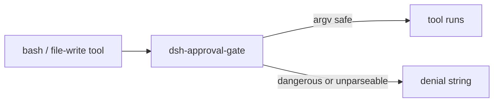

# @goodandready-private/dsh-approval-gate

<div align="center">

<h3>Last-line command gate for DeepSeek Harness</h3>

<p align="center">
  <a href="LICENSE"></a>
  <a href="https://github.com/topics/dsh-plugin"></a>
  <a href="https://nodejs.org"></a>
</p>

<p align="center">
  <a href="README.md"><b>English</b></a> ·
  <a href="README.zh.md"><b>中文说明</b></a> ·
  <a href="README.ru.md"><b>Русский</b></a>
</p>

</div>

---

## Overview

DeepSeek Harness can still let an agent run a dangerous tool call when sandbox mode is loose. This host-only plugin registers a monotonic `tools.guard` and denies the call before the tool body runs.

The operator then uses the existing approval word `делай`. This plugin does not implement that word; it only returns a denial string.

## How it works



`lib/inspect.js` tokenizes the bash `command` (quotes, backslashes, pipelines, wrappers) and inspects the real argv. File-write tools are classified by path, not by regex over prose.

## Coverage

| Call | Result |
|---|---|
| `rm -rf /tmp/x`, `sudo rm -r ...` | block |
| `kill` / `pkill` / `killall` as the command | block |
| `k''ill -9 1` (quoted fragments) | block |
| `systemctl restart\|stop\|disable ...` | block |
| `systemctl is-active dsh-web` | pass |
| `service name stop\|restart` | block |
| `sqlite3 ... DROP/ALTER/...` | block |
| `echo x > .env`, `tee`/`sed -i` on secret files | block |
| `write`/`edit` to `.env`, `credentials.yaml`, `settings.yaml`, `cordis.patch.yml` | block |
| `grep kill-all docs/`, `echo 'do not rm -rf'` | pass |
| `python3 -c "print('rm -rf')"` | pass |
| `$IFS`, `$(...)`, backticks, unclosed quotes, heredoc `<<` | block (unparseable) |
| `bash -c "rm -rf /tmp/x"` | block (nested shell) |
| empty / missing `command` | pass (nothing to run) |
| non-string `command` | block (unknown format) |

## What it does not guarantee

- It is not a full bash parser. Unknown shell syntax is denied, not guessed.
- Interpreter `-c`/`-e` is not a second language parser. Nested `bash -c` is inspected.
- Cron and systemd never pass through `tools.guard`.
- A script file created earlier and then executed as `bash ./run.sh` is not opened and scanned.

## Install

Private GitHub Packages route:

```sh
dsh plugin --profile web add @goodandready-private/dsh-approval-gate
```

Keep the guard enabled in profiles that need command-safety protection.

## Config

Optional fields on the Cordis patch entry:

| Field | Type | Default | Meaning |
|---|---|---|---|
| `toolName` | string | `bash` | Tool whose `command` argument is inspected |
| `fileWriteTools` | string[] | `write`, `edit`, `Write`, `Edit`, `str_replace`, `apply_patch` | Tools classified by path |

## License

MIT
