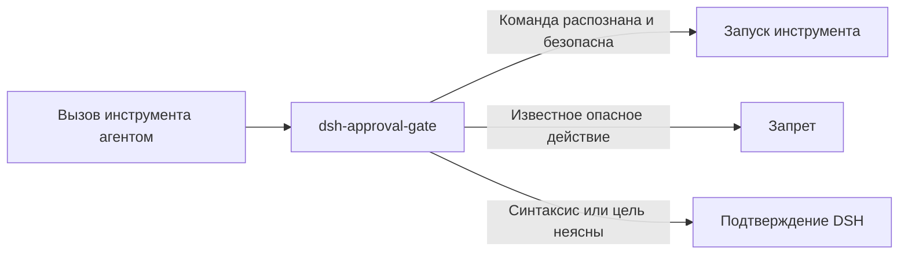

# 📦 @goodandready/dsh-approval-gate

<div align="center">

<h3>Дополнительная защита командных инструментов DSH</h3>

<p align="center">
  <a href="https://www.npmjs.com/package/@goodandready/dsh-approval-gate"></a>
  <a href="LICENSE"></a>
  <a href="https://github.com/topics/dsh-plugin"></a>
  <a href="https://nodejs.org"></a>
</p>

<p align="center">
  <a href="https://goodandready.app/"></a>
</p>

<p align="center">
  <a href="README.md"><b>🇬🇧 English</b></a> •
  <a href="README.zh.md"><b>🇨🇳 中文说明</b></a> •
  <a href="README.ru.md"><b>🇷🇺 Русский</b></a>
</p>

<table align="center">
  <tr><td align="center">⭐ <strong>Если вам нравится этот плагин, поставьте ему Star на GitHub</strong> — это покажет, что он полезен, и мотивирует продолжать его развитие.<br><br>🐛 <strong>Если вы нашли ошибку или хотите предложить функцию</strong>, создайте Issue на GitHub на любом языке — полезные предложения будут рассмотрены для следующих версий.</td></tr>
</table>

</div>

---

## Обзор

Плагин безопасности для хоста DSH: до запуска тела инструмента блокирует опасные вызовы bash и запись в защищённые файлы. Неопределённые команды передаются штатному механизму подтверждения DSH; плагин не вводит отдельное слово подтверждения.

Таблица покрытия, ограничения и конфигурация — в [README.md](README.md).

Установка (публичный пакет npm):

```sh
dsh plugin --profile web add @goodandready/dsh-approval-gate@0.1.3
```

## Изменения в v0.1.3

Первый публичный выпуск под идентичностью @goodandready/dsh-approval-gate.

Изменено в v0.1.3: прежние внутренние инструкции описывали отдельное слово подтверждения оператора. Публичная версия передаёт неопределённые команды штатному подтверждению DSH и не определяет собственное слово; новые установки используют публичный пакет npmjs.

Выпуск добавляет ограниченный разбор shell-синтаксиса и передаёт неопределённые случаи в запрос подтверждения DSH, сохраняя запреты на распознанные разрушительные команды и запись в защищённые файлы.

Анализатор shell-команд теперь понимает подстановки команд, обратные кавычки, подстановки процессов, основные перенаправления, включая 2> и &>, конвейеры и here-document. Он рекурсивно проверяет вложенные shell-команды и исполняемые раскрытия. Обычные безопасные чтения разрешены. Подстановка секрета в заголовок Authorization требует подтверждения: curl получает его как аргумент процесса. В этом пакете пока нет безопасного помощника для работы с учётными данными; не передавайте токен в аргументах команды.

Сервис локализации необязателен: если его нет, защитные хуки работают с английскими сообщениями.

Известные разрушительные команды и записи в защищённые файлы по-прежнему запрещены. К ним относятся рекурсивный rm, сигналы процессам, остановка и перезапуск служб, разрушительный SQL, запись в защищённые файлы, git reset --hard, принудительный git clean, mkfs, запись dd на устройство и передача загруженного содержимого shell.

Для незакрытого или неподдерживаемого синтаксиса, динамического имени команды или цели перенаправления, а также файла скрипта, содержимое которого невозможно проверить, DSH запрашивает подтверждение. Если подтверждение недоступно или задано approval=never, DSH отклоняет запрос. Плагин не читает файлы скриптов и не вводит отдельное слово подтверждения. Сообщение называет правило и показывает обезличенный фрагмент команды. Это ограниченный анализатор shell, а не полный парсер Bash.

## Архитектура и возможности

| Модуль | Назначение |
|---|---|
| lib/index.js | Регистрирует монотонный tools.guard и штатный pre-execution approval hook DSH, подключает проверки shell и файловых записей. |
| lib/inspect.js | Разбирает ограниченный shell-синтаксис, проверяет argv и подстановки, применяет правила опасных команд и защищённых записей, возвращает pass, deny или ask. |
| lib/messages.js | Содержит английские и китайские названия правил, пояснения и подписи для обезличенного фрагмента. |
| cordis.patch.yml | Объявляет host-пакет плагина и необязательную конфигурацию инструментов. |



Распознанные опасные действия запрещаются. Если нельзя проверить синтаксис, имя команды, аргументы, цель перенаправления или записи, плагин передаёт запрос штатному подтверждению DSH. При approval=never DSH отклоняет неопределённый запрос. Безопасные и полностью проверенные команды проходят.

### Что проверяется

| Пример вызова | Результат |
|---|---|
| rm -rf /tmp/x, sudo rm -r ... | Запрет |
| kill, pkill, killall | Запрет |
| systemctl stop/restart/disable | Запрет; systemctl is-active проходит |
| service name stop/restart | Запрет |
| Разрушительные DROP/ALTER и подобный SQL | Запрет |
| Запись в .env, credentials.yaml, settings.yaml или cordis.patch.yml | Запрет |
| Чтение защищённой настройки и упоминание опасной команды в обычном тексте | Разрешено |
| Незакрытый heredoc, динамическое имя команды или непроверяемый файл скрипта | Запрос подтверждения DSH |

### Настройка

В элементе плагина в Cordis patch можно задать поля:

| Поле | Тип | По умолчанию | Назначение |
|---|---|---|---|
| toolName | string | bash | Имя инструмента, аргумент command которого проверяется |
| fileWriteTools | string[] | write, edit, Write, Edit, str_replace, apply_patch | Инструменты записи, проверяемые по целевому пути |

### Пример Cordis-конфигурации

<pre><code>- insert:
    - id: dsh-approval-gate
      name: @goodandready/dsh-approval-gate
      config:
        toolName: bash
        fileWriteTools:
          - write
          - edit
          - Write
          - Edit
          - str_replace
          - apply_patch
</code></pre>

### Установка и ограничения

<pre><code>dsh plugin --profile web add @goodandready/dsh-approval-gate@0.1.3</code></pre>

Плагин не добавляет HTTP-маршруты или отдельную CLI-команду и не читает содержимое файлов скриптов. Это не системная песочница: команды cron и systemd, запущенные отдельно от инструментов DSH, он не перехватывает.


## Лицензия

MIT © [GooDAnDReaDY](https://github.com/GooDAnDReaDY)
