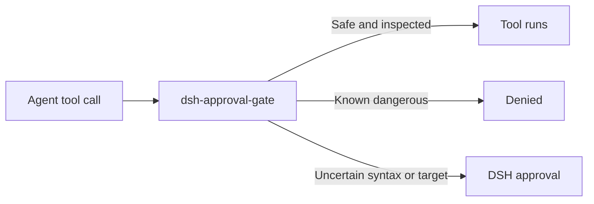

# 📦 @goodandready/dsh-approval-gate

<div align="center">

<h3>DSH shell 命令的最后一道安全防线</h3>

<p align="center">
  <a href="https://www.npmjs.com/package/@goodandready/dsh-approval-gate"></a>
  <a href="LICENSE"></a>
  <a href="https://github.com/topics/dsh-plugin"></a>
  <a href="https://nodejs.org"></a>
</p>

<p align="center">
  <a href="https://goodandready.app/"></a>
</p>

<p align="center">
  <a href="README.md"><b>🇬🇧 English</b></a> •
  <a href="README.zh.md"><b>🇨🇳 中文说明</b></a> •
  <a href="README.ru.md"><b>🇷🇺 Русский</b></a>
</p>

<table align="center">
  <tr><td align="center">⭐ <strong>如果您喜欢这个插件，请在 GitHub 上为它点亮 Star</strong> — 这能让我知道插件对您有用，并鼓励我继续开发和维护它。<br><br>🐛 <strong>如果您发现 Bug 或希望增加功能</strong>，请使用任意语言在 GitHub 上提交 Issue — 我会评估您的建议，并在后续版本中实现有价值的改进。</td></tr>
</table>

</div>

---

## 概述

仅运行于 DSH 主机的安全插件：在工具正文运行前拦截危险的 bash 调用以及对受保护文件的写入。无法完整检查的命令会通过 DSH 原生审批流程请求确认；本插件不实现单独的审批口令。

完整覆盖表、限制和配置见 [README.md](README.md)。

从公开 npm registry 安装：

```sh
dsh plugin --profile web add @goodandready/dsh-approval-gate@0.1.5
```

## v0.1.3 变更

这是以 @goodandready/dsh-approval-gate 身份发布到公开 npm registry 的首个版本。

变更说明：早期内部说明曾提到单独的操作者确认词。从 v0.1.3 起，无法确认的命令由 DSH 原生审批流程处理，本插件不定义自己的确认口令；新安装使用公开 npmjs 包。

本节说明 0.1.3 中的行为：扩展有界 shell 语法分析，并在无法确定语法或执行目标时请求 DSH 审批，同时保留对已识别破坏性操作和受保护文件写入的拒绝规则。

shell 分析器现在支持命令替换、反引号、进程替换、常见重定向（包括 2> 和 &>）、管道和 here-document，并递归检查嵌套 shell 命令及可执行展开。普通安全读取可以通过。展开的 Authorization 请求头需要审批，因为 curl 会把凭据作为进程参数接收。本包暂不提供安全的凭据 API 助手；请勿将令牌放入命令行参数。

语言服务是可选的；如果服务不可用，安全钩子仍会使用英文回退消息运行。

已识别的破坏性操作和受保护文件写入仍会被拒绝，包括递归 rm、进程信号、服务停止或重启、破坏性 SQL、受保护文件写入、git reset --hard、强制 git clean、mkfs、写入设备的 dd，以及将下载内容传给 shell。

未闭合或不支持的语法、动态命令名或重定向目标，以及无法检查内容的脚本文件，会通过 DSH 请求审批。审批不可用或配置为 approval=never 时，DSH 会拒绝请求。本插件不会读取脚本文件，也不实现独立审批口令。提示会显示规则名称和脱敏后的命令片段。这是有界 shell 分析器，并非完整 Bash 语法解析器。

## 架构与功能

| 模块 | 职责 |
|---|---|
| lib/index.js | 注册单调的 tools.guard 和 DSH 原生预执行审批钩子，并连接 shell 与文件写入检查器。 |
| lib/tokenizer.js | 对有界 shell 语法进行分词，提取操作符、here-document 和命令/参数替换。 |
| lib/inspect.js | 检查 argv 和展开内容，应用危险命令与受保护写入规则，并返回通过、拒绝或请求审批的结果。 |
| lib/messages.js | 提供英文、简体中文及俄文规则名称、说明及格式化提示。 |
| cordis.patch.yml | 声明 host 端插件包和可选工具配置。 |



已识别的危险操作会被拒绝。无法确认语法、命令名、参数、重定向目标或写入目标时，插件请求 DSH 审批。approval=never 时，DSH 仍会拒绝不确定请求。普通、安全且可检查的命令会通过。

### 覆盖范围

| 调用示例 | 结果 |
|---|---|
| rm -rf /tmp/x、sudo rm -r ... | 拒绝 |
| kill、pkill、killall | 拒绝 |
| systemctl stop/restart/disable | 拒绝；systemctl is-active 可通过 |
| service name stop/restart | 拒绝 |
| sqlite3 中的 DROP、ALTER 等破坏性 SQL | 拒绝 |
| 向 .env、credentials.yaml、settings.yaml 或 cordis.patch.yml 写入 | 拒绝 |
| 读取受保护配置、在普通文本中提及危险命令 | 通过 |
| 未闭合 heredoc、动态命令名或无法检查的脚本文件 | 请求 DSH 审批 |

### 配置

在 Cordis patch 的插件项中可选设置以下字段：

| 字段 | 类型 | 默认值 | 说明 |
|---|---|---|---|
| toolName | string | bash | 要检查 command 参数的工具名称 |
| fileWriteTools | string[] | write、edit、Write、Edit、str_replace、apply_patch | 按目标路径检查的文件写入工具 |

### Cordis 配置示例

<pre><code>- insert:
    - id: dsh-approval-gate
      name: @goodandready/dsh-approval-gate
      config:
        toolName: bash
        fileWriteTools:
          - write
          - edit
          - Write
          - Edit
          - str_replace
          - apply_patch
</code></pre>

### 安装与限制

<pre><code>dsh plugin --profile web add @goodandready/dsh-approval-gate@0.1.5</code></pre>

本插件不添加 HTTP 路由或独立 CLI，也不读取脚本文件内容。它不是操作系统沙箱，不会检查 cron 或 systemd 自行执行的命令。


## 许可证

MIT © [GooDAnDReaDY](https://github.com/GooDAnDReaDY)
