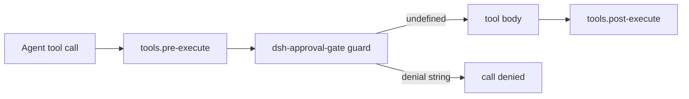

# Architecture baseline - dsh-approval-gate

Host-only Cordis plugin. `apply` registers a monotonic `tools.guard`. Returning a string denies the call; `undefined` leaves it allowed. Guards cannot force-allow a call another guard denied.

- `lib/inspect.js` tokenizes bash `command`, splits pipelines, skips wrappers (`sudo`, `timeout`, `env`), and classifies the real argv.
- File-write tool names (default `write`, `edit`, `Write`, `Edit`, `str_replace`, `apply_patch`) are classified by path, not by command text.
- Cron/systemd are out of scope: they never pass through `tools.guard`.
